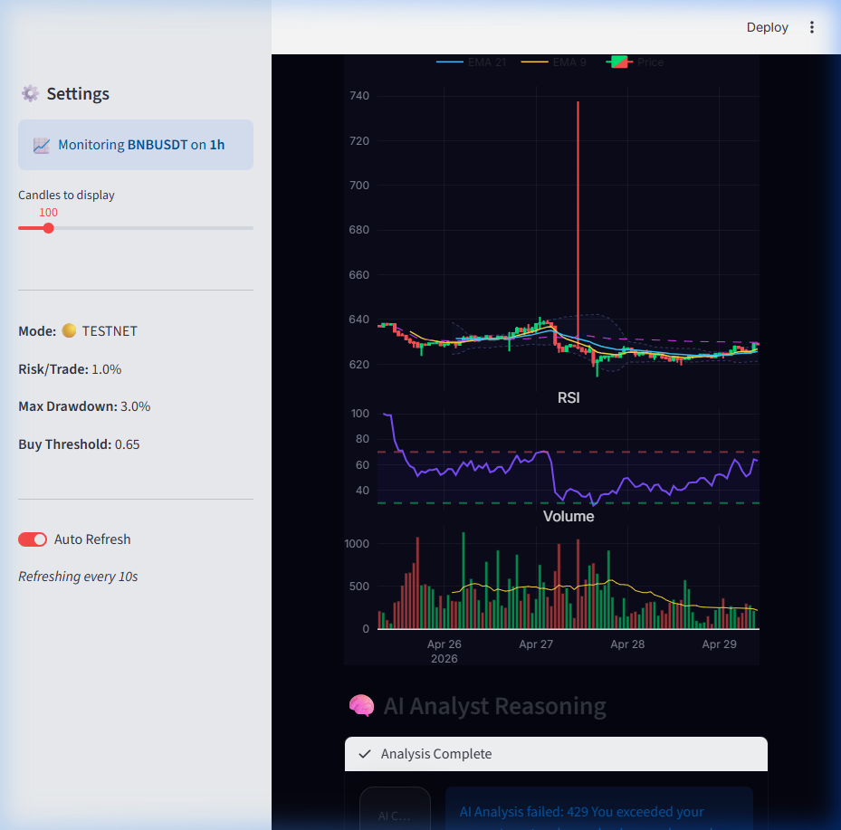

# 🤖 Binance AI-Enhanced Trading Bot

A high-frequency trading bot for Binance Spot markets, featuring **AI-Juried signals**, a **Dynamic Profit Ladder**, and a **Premium Real-Time Dashboard**.



## 🌟 Key Features

- **🧠 AI Trade Analyst**: Integrates with Google Gemini 1.5 (Pro/Flash) to validate technical signals. The bot only enters trades when technical indicators and AI reasoning reach a combined confluence.
- **🧗 Moon Ladder (Profit Ladder)**: A multi-stage exit strategy.
  - Automatically moves Stop Loss to lock in gains as price hits milestones (3%, 5%, 10%, 20%... up to 100%).
  - Secures profits while letting the "winners run."
- **💎 Premium Dashboard**: A high-end Streamlit dashboard with:
  - Glassmorphism UI design.
  - Real-time Plotly candlestick charts.
  - Live indicator tracking (RSI, MACD, Bollinger Bands, EMA).
  - Micro-animations for trade signals.
- **🛡️ Advanced Risk Management**: 
  - Dynamic Stop Loss.
  - Daily P&L monitoring and drawdown protection.
  - Automated retry logic for network stability ("Self-Healing").
- **🧪 Dry Run Mode**: Simulate trading in real-time without risking any capital.

## 🚀 Quick Start

### 1. Prerequisites
- Python 3.10+
- Binance API Key & Secret ([Binance Testnet](https://testnet.binance.vision/) recommended for initial setup)
- Google AI (Gemini) API Key

### 2. Installation
```bash
# Clone the repository
git clone https://github.com/Sachintha1994/Trading-Bot.git
cd Trading-Bot

# Create and activate virtual environment
python -m venv venv
source venv/bin/activate  # On Windows: venv\Scripts\activate

# Install dependencies
pip install -r requirements.txt
```

### 3. Configuration
Create a `.env` file in the root directory:
```env
BINANCE_API_KEY=your_api_key_here
BINANCE_API_SECRET=your_api_secret_here
GEMINI_API_KEY=your_gemini_key_here
```

Adjust trading parameters in `config.py`:
- `TRADING_PAIR`: The asset pair to trade (e.g., `SOLUSDT`, `ETHUSDT`).
- `TAKE_PROFIT_LADDER`: Customize your profit milestones.
- `DRY_RUN`: Set to `True` for simulation, `False` for real trading.

### 4. Running the Bot
```bash
# Start the Trading Engine
python main.py

# Launch the Visual Dashboard (New Terminal)
streamlit run dashboard/app.py
```

## 📊 Strategy Overview
The bot uses a **Confluence Strategy**:
1. **Technical Indicators**: RSI, MACD, Bollinger Bands, and EMA crossovers generate a base signal.
2. **AI Validation**: The current market state and technical reasons are sent to Google Gemini for a second opinion.
3. **Execution**: A trade is placed only if both systems agree on the entry.
4. **Ladder Exit**: As price hits targets, the Stop Loss is bumped up to the previous target, effectively "trailing" the profit.

## ⚠️ Disclaimer
This software is for educational purposes only. Use it at your own risk. The authors are not responsible for any financial losses incurred. Cryptocurrency trading involves high risk.

---
Built with ❤️ for the crypto community.
